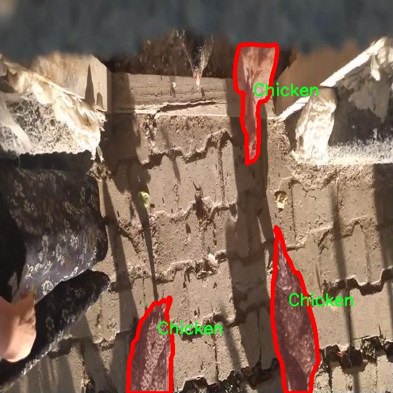

### 1.背景意义

研究背景与意义

随着全球对食品安全和动物福利的关注日益增强，家禽健康监测系统的开发变得尤为重要。鸡只作为全球最主要的肉类和蛋类来源之一，其健康状况直接影响到生产效率和食品安全。因此，建立一个高效、准确的鸡只健康状态检测系统，能够及时识别健康和病态鸡只，对于养殖业的可持续发展具有重要意义。

传统的鸡只健康监测方法多依赖人工观察，这不仅耗时耗力，而且容易受到主观因素的影响，导致检测结果的不准确性。近年来，计算机视觉技术的快速发展为动物健康监测提供了新的解决方案。基于深度学习的目标检测算法，尤其是YOLO（You Only Look Once）系列算法，因其高效性和实时性，逐渐成为研究的热点。YOLOv11作为该系列的最新版本，具备更强的特征提取能力和更快的处理速度，能够在复杂环境中实现对鸡只健康状态的精准识别。

本研究旨在基于改进的YOLOv11算法，构建一个鸡只健康状态检测系统。该系统将能够自动识别和分类鸡只的健康状态，包括健康鸡只和跛脚鸡只，从而为养殖场提供实时监测和预警机制。通过对数据集的深入分析，我们将重点关注鸡只的行为特征与健康状态之间的关系，利用深度学习技术提取关键特征，以提高检测的准确性和鲁棒性。

此外，本研究的成功实施不仅将为养殖业提供技术支持，提升生产效率，还将为动物福利的提升贡献力量。通过及时发现和处理病态鸡只，减少疾病传播的风险，从而实现健康养殖和可持续发展的目标。因此，基于改进YOLOv11的鸡只健康状态检测系统的研究具有重要的理论价值和实际应用意义。

### 2.视频效果

[2.1 视频效果](https://www.bilibili.com/video/BV1MoU3Y5EvA/)

### 3.图片效果


##### [项目涉及的源码数据来源链接](https://kdocs.cn/l/cszuIiCKVNis)**

注意：本项目提供训练的数据集和训练教程,由于版本持续更新,暂不提供权重文件（best.pt）,请按照6.训练教程进行训练后实现上图演示的效果。

### 4.数据集信息

##### 4.1 本项目数据集类别数＆类别名

nc: 3
names: ['Chicken', 'Healthy_chick', 'Lame_chick']


该项目为【图像分割】数据集，请在【训练教程和Web端加载模型教程（第三步）】这一步的时候按照【图像分割】部分的教程来训练

##### 4.2 本项目数据集信息介绍

本项目数据集信息介绍

本项目所使用的数据集旨在支持改进YOLOv11模型，以实现对鸡只健康状态的高效检测。该数据集专注于“Chicken_detection”主题，涵盖了与鸡只健康状况相关的多种特征。数据集中共包含三类主要类别，分别为“Chicken”、“Healthy_chick”和“Lame_chick”。这些类别的划分不仅有助于模型的训练与优化，也为后续的健康状态评估提供了基础。

在数据集的构建过程中，研究团队收集了大量的鸡只图像，确保每一类的样本数量均衡且多样化，以提高模型的泛化能力和准确性。具体而言，“Chicken”类别包含了各种姿态和环境下的鸡只图像，旨在帮助模型学习到鸡只的基本特征。而“Healthy_chick”类别则专注于健康状态良好的鸡只图像，展示了它们的活跃行为和正常的生理特征。相对而言，“Lame_chick”类别则包含了表现出跛行或其他健康问题的鸡只图像，帮助模型识别出潜在的健康隐患。

通过这样的数据集设计，项目不仅能够训练出高效的检测系统，还能在实际应用中提供准确的健康状态评估。这对于养殖业者而言，具有重要的现实意义，能够帮助他们及时发现并处理鸡只的健康问题，从而提高养殖效率和经济效益。此外，数据集的多样性和丰富性也为未来的研究提供了广阔的空间，推动鸡只健康监测技术的进一步发展。整体而言，本项目的数据集为改进YOLOv11模型提供了坚实的基础，助力于实现更为精准的鸡只健康状态检测。




### 5.全套项目环境部署视频教程（零基础手把手教学）

[5.1 所需软件PyCharm和Anaconda安装教程（第一步）](https://www.bilibili.com/video/BV1BoC1YCEKi/?spm_id_from=333.999.0.0&vd_source=bc9aec86d164b67a7004b996143742dc)


[5.2 安装Python虚拟环境创建和依赖库安装视频教程（第二步）](https://www.bilibili.com/video/BV1ZoC1YCEBw?spm_id_from=333.788.videopod.sections&vd_source=bc9aec86d164b67a7004b996143742dc)

### 6.改进YOLOv11训练教程和Web_UI前端加载模型教程（零基础手把手教学）

[6.1 改进YOLOv11训练教程和Web_UI前端加载模型教程（第三步）](https://www.bilibili.com/video/BV1BoC1YCEhR?spm_id_from=333.788.videopod.sections&vd_source=bc9aec86d164b67a7004b996143742dc)


按照上面的训练视频教程链接加载项目提供的数据集，运行train.py即可开始训练



     Epoch   gpu_mem       box       obj       cls    labels  img_size
     1/200     20.8G   0.01576   0.01955  0.007536        22      1280: 100%|██████████| 849/849 [14:42<00:00,  1.04s/it]
               Class     Images     Labels          P          R     mAP@.5 mAP@.5:.95: 100%|██████████| 213/213 [01:14<00:00,  2.87it/s]
                 all       3395      17314      0.994      0.957      0.0957      0.0843

     Epoch   gpu_mem       box       obj       cls    labels  img_size
     2/200     20.8G   0.01578   0.01923  0.007006        22      1280: 100%|██████████| 849/849 [14:44<00:00,  1.04s/it]
               Class     Images     Labels          P          R     mAP@.5 mAP@.5:.95: 100%|██████████| 213/213 [01:12<00:00,  2.95it/s]
                 all       3395      17314      0.996      0.956      0.0957      0.0845

     Epoch   gpu_mem       box       obj       cls    labels  img_size
     3/200     20.8G   0.01561    0.0191  0.006895        27      1280: 100%|██████████| 849/849 [10:56<00:00,  1.29it/s]
               Class     Images     Labels          P          R     mAP@.5 mAP@.5:.95: 100%|███████   | 187/213 [00:52<00:00,  4.04it/s]
                 all       3395      17314      0.996      0.957      0.0957      0.0845


###### [项目数据集下载链接](https://kdocs.cn/l/cszuIiCKVNis)

### 7.原始YOLOv11算法讲解

YOLOv11是Ultralytics推出的YOLO系列最新版本，专为实现尖端的物体检测而设计。其架构和训练方法上进行了重大改进，使之不仅具备卓越的准确性和处理速度，还在计算效率上实现了一场革命。得益于其改进的主干和颈部架构，YOLOv11在特征提取和处理复杂任务时表现更加出色。在2024年9月27日，Ultralytics通过长达九小时的在线直播发布这一新作，展示了其在计算机视觉领域的革新。

YOLOv11通过精细的架构设计和优化训练流程，在保持高精度的同时，缩减了参数量，与YOLOv8m相比减少了22%的参数，使其在COCO数据集上的平均准确度（mAP）有所提升。这种效率的提高使YOLOv11非常适合部署在各种硬件环境中，包括边缘设备、云计算平台以及支持NVIDIA GPU的系统，确保在灵活性上的优势。

该模型支持广泛的任务，从对象检测、实例分割到图像分类、姿态估计和定向对象检测（OBB），几乎覆盖了计算机视觉的所有主要挑战。其创新的C3k2和C2PSA模块提升了网络深度和注意力机制的应用，提高了特征提取的效率和效果。同时，YOLOv11的改进网络结构也使之在复杂视觉任务上得以从容应对，成为各类计算机视觉任务的多功能选择。这些特性令YOLOv11在实施实时物体检测的各个领域中表现出众。
* * *

2024年9月27日，Ultralytics在线直播长达九小时，为YOLO11召开“发布会”

YOLO11 是 Ultralytics YOLO 系列实时物体检测器的最新版本，它以尖端的准确性、速度和效率重新定义了可能性。在之前 YOLO
版本的显著进步的基础上，YOLO11 在架构和训练方法方面进行了重大改进，使其成为各种计算机视觉任务的多功能选择。


##### YOLO11主要特点：

  * 增强的特征提取：YOLO11 采用了改进的主干和颈部架构，增强了特征提取能力，可实现更精确的对象检测和复杂任务性能。
  * 针对效率和速度进行了优化：YOLO11 引入了完善的架构设计和优化的训练流程，可提供更快的处理速度，并在准确度和性能之间保持最佳平衡。
  * 更少的参数，更高的准确度：借助模型设计的进步，YOLO11m 在 COCO 数据集上实现了更高的平均准确度 (mAP)，同时使用的参数比 YOLOv8m 少 22%，从而提高了计算效率，同时又不影响准确度。
  * 跨环境的适应性：YOLO11 可以无缝部署在各种环境中，包括边缘设备、云平台和支持 NVIDIA GPU 的系统，从而确保最大的灵活性。
  * 支持的任务范围广泛：无论是对象检测、实例分割、图像分类、姿势估计还是定向对象检测 (OBB)，YOLO11 都旨在满足各种计算机视觉挑战。

##### 支持的任务和模式

YOLO11 以 YOLOv8 中引入的多功能模型系列为基础，为各种计算机视觉任务提供增强的支持：

Model| Filenames| Task| Inference| Validation| Training| Export  
---|---|---|---|---|---|---  
YOLO11| yolol11n.pt, yolol11s.pt, yolol11m.pt, yolol11x.pt| Detection| ✅| ✅|
✅| ✅  
YOLO11-seg| yolol11n-seg.pt, yolol11s-seg.pt, yolol11m-seg.pt,
yolol11x-seg.pt| Instance Segmentation| ✅| ✅| ✅| ✅  
YOLO11-pose| yolol11n-pose.pt, yolol11s-pose.pt, yolol11m-pose.pt,
yolol11x-pose.pt| Pose/Keypoints| ✅| ✅| ✅| ✅  
YOLO11-obb| yolol11n-obb.pt, yolol11s-obb.pt, yolol11m-obb.pt,
yolol11x-obb.pt| Oriented Detection| ✅| ✅| ✅| ✅  
YOLO11-cls| yolol11n-cls.pt, yolol11s-cls.pt, yolol11m-cls.pt,
yolol11x-cls.pt| Classification| ✅| ✅| ✅| ✅  
  
##### 简单的 YOLO11 训练和推理示例

以下示例适用于用于对象检测的 YOLO11 Detect 模型。

    
    
    from ultralytics import YOLO
    
    # Load a model
    model = YOLO("yolo11n.pt")
    
    # Train the model
    train_results = model.train(
        data="coco8.yaml",  # path to dataset YAML
        epochs=100,  # number of training epochs
        imgsz=640,  # training image size
        device="cpu",  # device to run on, i.e. device=0 or device=0,1,2,3 or device=cpu
    )
    
    # Evaluate model performance on the validation set
    metrics = model.val()
    
    # Perform object detection on an image
    results = model("path/to/image.jpg")
    results[0].show()
    
    # Export the model to ONNX format
    path = model.export(format="onnx")  # return path to exported model

##### 支持部署于边缘设备

YOLO11 专为适应各种环境而设计，包括边缘设备。其优化的架构和高效的处理能力使其适合部署在边缘设备、云平台和支持 NVIDIA GPU
的系统上。这种灵活性确保 YOLO11 可用于各种应用，从移动设备上的实时检测到云环境中的复杂分割任务。有关部署选项的更多详细信息，请参阅导出文档。

##### YOLOv11 yaml文件

    
    
    # Ultralytics YOLO 🚀, AGPL-3.0 license
    # YOLO11 object detection model with P3-P5 outputs. For Usage examples see https://docs.ultralytics.com/tasks/detect
    
    # Parameters
    nc: 80 # number of classes
    scales: # model compound scaling constants, i.e. 'model=yolo11n.yaml' will call yolo11.yaml with scale 'n'
      # [depth, width, max_channels]
      n: [0.50, 0.25, 1024] # summary: 319 layers, 2624080 parameters, 2624064 gradients, 6.6 GFLOPs
      s: [0.50, 0.50, 1024] # summary: 319 layers, 9458752 parameters, 9458736 gradients, 21.7 GFLOPs
      m: [0.50, 1.00, 512] # summary: 409 layers, 20114688 parameters, 20114672 gradients, 68.5 GFLOPs
      l: [1.00, 1.00, 512] # summary: 631 layers, 25372160 parameters, 25372144 gradients, 87.6 GFLOPs
      x: [1.00, 1.50, 512] # summary: 631 layers, 56966176 parameters, 56966160 gradients, 196.0 GFLOPs
    
    # YOLO11n backbone
    backbone:
      # [from, repeats, module, args]
      - [-1, 1, Conv, [64, 3, 2]] # 0-P1/2
      - [-1, 1, Conv, [128, 3, 2]] # 1-P2/4
      - [-1, 2, C3k2, [256, False, 0.25]]
      - [-1, 1, Conv, [256, 3, 2]] # 3-P3/8
      - [-1, 2, C3k2, [512, False, 0.25]]
      - [-1, 1, Conv, [512, 3, 2]] # 5-P4/16
      - [-1, 2, C3k2, [512, True]]
      - [-1, 1, Conv, [1024, 3, 2]] # 7-P5/32
      - [-1, 2, C3k2, [1024, True]]
      - [-1, 1, SPPF, [1024, 5]] # 9
      - [-1, 2, C2PSA, [1024]] # 10
    
    # YOLO11n head
    head:
      - [-1, 1, nn.Upsample, [None, 2, "nearest"]]
      - [[-1, 6], 1, Concat, [1]] # cat backbone P4
      - [-1, 2, C3k2, [512, False]] # 13
    
      - [-1, 1, nn.Upsample, [None, 2, "nearest"]]
      - [[-1, 4], 1, Concat, [1]] # cat backbone P3
      - [-1, 2, C3k2, [256, False]] # 16 (P3/8-small)
    
      - [-1, 1, Conv, [256, 3, 2]]
      - [[-1, 13], 1, Concat, [1]] # cat head P4
      - [-1, 2, C3k2, [512, False]] # 19 (P4/16-medium)
    
      - [-1, 1, Conv, [512, 3, 2]]
      - [[-1, 10], 1, Concat, [1]] # cat head P5
      - [-1, 2, C3k2, [1024, True]] # 22 (P5/32-large)
    
      - [[16, 19, 22], 1, Detect, [nc]] # Detect(P3, P4, P5)
    

**YOLO11和YOLOv8 yaml文件的区别**


##### 改进模块代码

  * C3k2 

    
    
    class C3k2(C2f):
        """Faster Implementation of CSP Bottleneck with 2 convolutions."""
    
        def __init__(self, c1, c2, n=1, c3k=False, e=0.5, g=1, shortcut=True):
            """Initializes the C3k2 module, a faster CSP Bottleneck with 2 convolutions and optional C3k blocks."""
            super().__init__(c1, c2, n, shortcut, g, e)
            self.m = nn.ModuleList(
                C3k(self.c, self.c, 2, shortcut, g) if c3k else Bottleneck(self.c, self.c, shortcut, g) for _ in range(n)
            )

C3k2，它是具有两个卷积的CSP（Partial Cross Stage）瓶颈架构的更快实现。

**类继承：**

  * `C3k2`继承自类`C2f`。这表明`C2f`很可能实现了经过修改的基本CSP结构，而`C3k2`进一步优化或修改了此结构。

**构造函数（`__init__`）：**

  * `c1`：输入通道。

  * `c2`：输出通道。

  * `n`：瓶颈层数（默认为1）。

  * `c3k`：一个布尔标志，确定是否使用`C3k`块或常规`Bottleneck`块。

  * `e`：扩展比率，控制隐藏层的宽度（默认为0.5）。

  * `g`：分组卷积的组归一化参数或组数（默认值为 1）。

  * `shortcut`：一个布尔值，用于确定是否在网络中包含快捷方式连接（默认值为 `True`）。

**初始化：**

  * `super().__init__(c1, c2, n, short-cut, g, e)` 调用父类 `C2f` 的构造函数，初始化标准 CSP 组件，如通道数、快捷方式、组等。

**模块列表（`self.m`）：**

  * `nn.ModuleList` 存储 `C3k` 或 `Bottleneck` 模块，具体取决于 `c3k` 的值。

  * 如果 `c3k` 为 `True`，它会初始化 `C3k` 模块。`C3k` 模块接收以下参数：

  * `self.c`：通道数（源自 `C2f`）。

  * `2`：这表示在 `C3k` 块内使用了两个卷积层。

  * `shortcut` 和 `g`：从 `C3k2` 构造函数传递。

  * 如果 `c3k` 为 `False`，则初始化标准 `Bottleneck` 模块。

`for _ in range(n)` 表示将创建 `n` 个这样的块。

**总结：**

  * `C3k2` 实现了 CSP 瓶颈架构，可以选择使用自定义 `C3k` 块（具有两个卷积）或标准 `Bottleneck` 块，具体取决于 `c3k` 标志。

  * C2PSA

    
    
    class C2PSA(nn.Module):
        """
        C2PSA module with attention mechanism for enhanced feature extraction and processing.
    
        This module implements a convolutional block with attention mechanisms to enhance feature extraction and processing
        capabilities. It includes a series of PSABlock modules for self-attention and feed-forward operations.
    
        Attributes:
            c (int): Number of hidden channels.
            cv1 (Conv): 1x1 convolution layer to reduce the number of input channels to 2*c.
            cv2 (Conv): 1x1 convolution layer to reduce the number of output channels to c.
            m (nn.Sequential): Sequential container of PSABlock modules for attention and feed-forward operations.
    
        Methods:
            forward: Performs a forward pass through the C2PSA module, applying attention and feed-forward operations.
    
        Notes:
            This module essentially is the same as PSA module, but refactored to allow stacking more PSABlock modules.
    
        Examples:
            >>> c2psa = C2PSA(c1=256, c2=256, n=3, e=0.5)
            >>> input_tensor = torch.randn(1, 256, 64, 64)
            >>> output_tensor = c2psa(input_tensor)
        """
    
        def __init__(self, c1, c2, n=1, e=0.5):
            """Initializes the C2PSA module with specified input/output channels, number of layers, and expansion ratio."""
            super().__init__()
            assert c1 == c2
            self.c = int(c1 * e)
            self.cv1 = Conv(c1, 2 * self.c, 1, 1)
            self.cv2 = Conv(2 * self.c, c1, 1)
    
            self.m = nn.Sequential(*(PSABlock(self.c, attn_ratio=0.5, num_heads=self.c // 64) for _ in range(n)))
    
        def forward(self, x):
            """Processes the input tensor 'x' through a series of PSA blocks and returns the transformed tensor."""
            a, b = self.cv1(x).split((self.c, self.c), dim=1)
            b = self.m(b)
            return self.cv2(torch.cat((a, b), 1))

`C2PSA` 模块是一个自定义神经网络层，带有注意力机制，用于增强特征提取和处理。

**类概述**

  * **目的：**

  * `C2PSA` 模块引入了一个卷积块，利用注意力机制来改进特征提取和处理。

  * 它使用一系列 `PSABlock` 模块，这些模块可能代表某种形式的位置自注意力 (PSA)，并且该架构旨在允许堆叠多个 `PSABlock` 层。

**构造函数（`__init__`）：**

  * **参数：**

  * `c1`：输入通道（必须等于 `c2`）。

  * `c2`：输出通道（必须等于 `c1`）。

  * `n`：要堆叠的 `PSABlock` 模块数量（默认值为 1）。

  * `e`：扩展比率，用于计算隐藏通道的数量（默认值为 0.5）。

  * **属性：**

  * `self.c`：隐藏通道数，计算为 `int(c1 * e)`。

  * `self.cv1`：一个 `1x1` 卷积，将输入通道数从 `c1` 减少到 `2 * self.c`。这为将输入分成两部分做好准备。

  * `self.cv2`：另一个 `1x1` 卷积，处理后将通道维度恢复回 `c1`。

  * `self.m`：一系列 `PSABlock` 模块。每个 `PSABlock` 接收 `self.c` 通道，注意头的数量为 `self.c // 64`。每个块应用注意和前馈操作。

**前向方法：**

  * **输入：**

  * `x`，输入张量。

  * **操作：**

  1. `self.cv1(x)` 应用 `1x1` 卷积，将输入通道大小从 `c1` 减小到 `2 * self.c`。

  2. 生成的张量沿通道维度分为两部分，`a` 和 `b`。

  * `a`：第一个 `self.c` 通道。

  * `b`：剩余的 `self.c` 通道。

  1. `b` 通过顺序容器 `self.m`，它是 `PSABlock` 模块的堆栈。这部分经过基于注意的处理。

  2. 处理后的张量 `b` 与 `a` 连接。

  3. `self.cv2` 应用 `1x1` 卷积，将通道大小恢复为 `c1`。

  * **输出：**

  * 应用注意和卷积操作后的变换后的张量。

**总结：**

  * **C2PSA** 是一个增强型卷积模块，它通过堆叠的 `PSABlock` 模块应用位置自注意力。它拆分输入张量，将注意力应用于其中一部分，然后重新组合并通过最终卷积对其进行处理。此结构有助于从输入数据中提取复杂特征。

##### 网络结构


### 8.200+种全套改进YOLOV11创新点原理讲解

#### 8.1 200+种全套改进YOLOV11创新点原理讲解大全

由于篇幅限制，每个创新点的具体原理讲解就不全部展开，具体见下列网址中的改进模块对应项目的技术原理博客网址【Blog】（创新点均为模块化搭建，原理适配YOLOv5~YOLOv11等各种版本）

[改进模块技术原理博客【Blog】网址链接](https://gitee.com/qunmasj/good)


#### 8.2 精选部分改进YOLOV11创新点原理讲解

###### 这里节选部分改进创新点展开原理讲解(完整的改进原理见上图和[改进模块技术原理博客链接](https://gitee.com/qunmasj/good)【如果此小节的图加载失败可以通过CSDN或者Github搜索该博客的标题访问原始博客，原始博客图片显示正常】


### 空间和通道重建卷积SCConv
参考该博客提出的一种高效的卷积模块，称为SCConv (spatial and channel reconstruction convolution)，以减少冗余计算并促进代表性特征的学习。提出的SCConv由空间重构单元(SRU)和信道重构单元(CRU)两个单元组成。

（1）SRU根据权重分离冗余特征并进行重构，以抑制空间维度上的冗余，增强特征的表征。

（2）CRU采用分裂变换和融合策略来减少信道维度的冗余以及计算成本和存储。

（3）SCConv是一种即插即用的架构单元，可直接用于替代各种卷积神经网络中的标准卷积。实验结果表明，scconvo嵌入模型能够通过减少冗余特征来获得更好的性能，并且显著降低了复杂度和计算成本。


SCConv如图所示，它由两个单元组成，空间重建单元(SRU)和通道重建单元(CRU)，以顺序的方式放置。具体而言，对于瓶颈残差块中的中间输入特征X，首先通过SRU运算获得空间细化特征Xw，然后利用CRU运算获得信道细化特征Y。SCConv模块充分利用了特征之间的空间冗余和通道冗余，可以无缝集成到任何CNN架构中，以减少中间特征映射之间的冗余并增强CNN的特征表示。

#### SRU单元用于空间冗余


为了利用特征的空间冗余，引入了空间重构单元(SRU)，如图2所示，它利用了分离和重构操作。

分离操作 的目的是将信息丰富的特征图与空间内容对应的信息较少的特征图分离开来。我们利用组归一化(GN)层中的比例因子来评估不同特征图的信息内容。具体来说，给定一个中间特征映射X∈R N×C×H×W，首先通过减去平均值µ并除以标准差σ来标准化输入特征X，如下所示:


其中µ和σ是X的均值和标准差，ε是为了除法稳定性而加入的一个小的正常数，γ和β是可训练的仿射变换。

GN层中的可训练参数\gamma \in R^{C}用于测量每个批次和通道的空间像素方差。更丰富的空间信息反映了空间像素的更多变化，从而导致更大的γ。归一化相关权重W_{\gamma} \in R^{C}由下面公式2得到，表示不同特征映射的重要性。


然后将经Wγ重新加权的特征映射的权值通过sigmoid函数映射到(0,1)范围，并通过阈值进行门控。我们将阈值以上的权重设置为1，得到信息权重W1，将其设置为0，得到非信息权重W2(实验中阈值设置为0.5)。获取W的整个过程可以用公式表示。


最后将输入特征X分别乘以W1和W2，得到两个加权特征:信息量较大的特征X_{1}^{\omega }和信息量较小的特征X_{2}^{\omega }。这样就成功地将输入特征分为两部分:X_{1}^{\omega }具有信息量和表达性的空间内容，而X_{2}^{\omega }几乎没有信息，被认为是冗余的。

重构操作 将信息丰富的特征与信息较少的特征相加，生成信息更丰富的特征，从而节省空间空间。采用交叉重构运算，将加权后的两个不同的信息特征充分结合起来，加强它们之间的信息流。然后将交叉重构的特征X^{\omega1}和X^{\omega2}进行拼接，得到空间精细特征映射X^{\omega}。从后过程表示如下：


其中⊗是逐元素的乘法，⊕是逐元素的求和，∪是串联。将SRU应用于中间输入特征X后，不仅将信息特征与信息较少的特征分离，而且对其进行重构，增强代表性特征，抑制空间维度上的冗余特征。然而，空间精细特征映射X^{\omega}在通道维度上仍然是冗余的。

#### CRU单元用于通道冗余


分割 操作将输入的空间细化特征X^{\omega}分割成两个部分，一部分通道数是\alpha C，另一部分通道数是(1-\alpha) C，随后对两组特征的通道数使用1 * 1卷积核进行压缩，分别得到X_{up}和X_{low}。

转换 操作将输入的X_{up}作为“富特征提取”的输入，分别进行GWC和PWC，然后相加得到输出Y1，将输入X_{low}作为“富特征提取”的补充，进行PWC，得到的记过和原来的输入取并集得到Y2。

融合 操作使用简化的SKNet方法来自适应合并Y1和Y2。具体说是首先使用全局平均池化将全局空间信息和通道统计信息结合起来，得到经过池化的S1和S2。然后对S1和S2做Softmax得到特征权重向量\beta _{1}和\beta _{2}，最后使用特征权重向量得到输出Y = \beta _{1}*Y_{1} + \beta _{2}*Y_{2}，Y即为通道提炼的特征。


### 9.系统功能展示

图9.1.系统支持检测结果表格显示

  图9.2.系统支持置信度和IOU阈值手动调节

  图9.3.系统支持自定义加载权重文件best.pt(需要你通过步骤5中训练获得)

  图9.4.系统支持摄像头实时识别

  图9.5.系统支持图片识别

  图9.6.系统支持视频识别

  图9.7.系统支持识别结果文件自动保存

  图9.8.系统支持Excel导出检测结果数据


### 10. YOLOv11核心改进源码讲解

#### 10.1 EfficientFormerV2.py

以下是对给定代码的核心部分进行分析和详细注释的结果：

```python
import torch
import torch.nn as nn
import math
import itertools

class Attention4D(nn.Module):
    """
    4D注意力机制模块
    """
    def __init__(self, dim=384, key_dim=32, num_heads=8, attn_ratio=4, resolution=7, act_layer=nn.ReLU, stride=None):
        super().__init__()
        self.num_heads = num_heads  # 注意力头的数量
        self.scale = key_dim ** -0.5  # 缩放因子
        self.key_dim = key_dim  # 键的维度
        self.nh_kd = key_dim * num_heads  # 每个头的键的维度总和

        # 如果有步幅，则进行卷积和上采样
        if stride is not None:
            self.resolution = math.ceil(resolution / stride)  # 计算新的分辨率
            self.stride_conv = nn.Sequential(
                nn.Conv2d(dim, dim, kernel_size=3, stride=stride, padding=1, groups=dim),
                nn.BatchNorm2d(dim),
            )
            self.upsample = nn.Upsample(scale_factor=stride, mode='bilinear')
        else:
            self.resolution = resolution
            self.stride_conv = None
            self.upsample = None

        self.N = self.resolution ** 2  # 计算注意力矩阵的大小
        self.d = int(attn_ratio * key_dim)  # 计算注意力的输出维度
        self.dh = self.d * num_heads  # 计算所有头的输出维度总和

        # 定义查询、键、值的卷积层
        self.q = nn.Sequential(nn.Conv2d(dim, self.num_heads * self.key_dim, 1), nn.BatchNorm2d(self.num_heads * self.key_dim))
        self.k = nn.Sequential(nn.Conv2d(dim, self.num_heads * self.key_dim, 1), nn.BatchNorm2d(self.num_heads * self.key_dim))
        self.v = nn.Sequential(nn.Conv2d(dim, self.num_heads * self.d, 1), nn.BatchNorm2d(self.num_heads * self.d))

        # 定义局部值的卷积层
        self.v_local = nn.Sequential(
            nn.Conv2d(self.num_heads * self.d, self.num_heads * self.d, kernel_size=3, stride=1, padding=1, groups=self.num_heads * self.d),
            nn.BatchNorm2d(self.num_heads * self.d),
        )

        # 定义头部的卷积层
        self.talking_head1 = nn.Conv2d(self.num_heads, self.num_heads, kernel_size=1)
        self.talking_head2 = nn.Conv2d(self.num_heads, self.num_heads, kernel_size=1)

        # 定义输出的卷积层
        self.proj = nn.Sequential(act_layer(), nn.Conv2d(self.dh, dim, 1), nn.BatchNorm2d(dim))

        # 计算注意力偏置
        points = list(itertools.product(range(self.resolution), range(self.resolution)))
        attention_offsets = {}
        idxs = []
        for p1 in points:
            for p2 in points:
                offset = (abs(p1[0] - p2[0]), abs(p1[1] - p2[1]))
                if offset not in attention_offsets:
                    attention_offsets[offset] = len(attention_offsets)
                idxs.append(attention_offsets[offset])
        self.attention_biases = nn.Parameter(torch.zeros(num_heads, len(attention_offsets)))
        self.register_buffer('attention_bias_idxs', torch.LongTensor(idxs).view(self.N, self.N))

    def forward(self, x):  # x (B, C, H, W)
        B, C, H, W = x.shape
        if self.stride_conv is not None:
            x = self.stride_conv(x)  # 应用步幅卷积

        # 计算查询、键、值
        q = self.q(x).flatten(2).reshape(B, self.num_heads, -1, self.N).permute(0, 1, 3, 2)
        k = self.k(x).flatten(2).reshape(B, self.num_heads, -1, self.N).permute(0, 1, 2, 3)
        v = self.v(x)
        v_local = self.v_local(v)
        v = v.flatten(2).reshape(B, self.num_heads, -1, self.N).permute(0, 1, 3, 2)

        # 计算注意力权重
        attn = (q @ k) * self.scale + self.attention_biases[:, self.attention_bias_idxs]
        attn = self.talking_head1(attn).softmax(dim=-1)
        attn = self.talking_head2(attn)

        # 计算输出
        x = (attn @ v)
        out = x.transpose(2, 3).reshape(B, self.dh, self.resolution, self.resolution) + v_local
        if self.upsample is not None:
            out = self.upsample(out)

        out = self.proj(out)  # 最终输出
        return out


class EfficientFormerV2(nn.Module):
    """
    EfficientFormer V2模型
    """
    def __init__(self, layers, embed_dims=None, mlp_ratios=4, downsamples=None, num_classes=1000, drop_rate=0., drop_path_rate=0.):
        super().__init__()
        self.patch_embed = nn.Sequential(
            nn.Conv2d(3, embed_dims[0], kernel_size=3, stride=2, padding=1),
            nn.BatchNorm2d(embed_dims[0]),
            nn.ReLU(),
        )

        network = []
        for i in range(len(layers)):
            # 构建每一层的网络结构
            stage = eformer_block(embed_dims[i], i, layers, mlp_ratio=mlp_ratios)
            network.append(stage)
            if downsamples[i] or embed_dims[i] != embed_dims[i + 1]:
                network.append(Embedding(patch_size=3, stride=2, in_chans=embed_dims[i], embed_dim=embed_dims[i + 1]))

        self.network = nn.ModuleList(network)

    def forward(self, x):
        x = self.patch_embed(x)  # 输入图像经过嵌入层
        for block in self.network:
            x = block(x)  # 依次通过每个块
        return x


def efficientformerv2_s0(weights='', **kwargs):
    """
    创建EfficientFormer V2 S0模型
    """
    model = EfficientFormerV2(
        layers=[2, 2, 6, 4],  # 各层的深度
        embed_dims=[32, 48, 96, 176],  # 各层的嵌入维度
        downsamples=[True, True, True, True],  # 是否下采样
        **kwargs
    )
    if weights:
        pretrained_weight = torch.load(weights)['model']
        model.load_state_dict(pretrained_weight)  # 加载预训练权重
    return model


if __name__ == '__main__':
    inputs = torch.randn((1, 3, 640, 640))  # 创建一个随机输入
    model = efficientformerv2_s0()  # 创建模型
    res = model(inputs)  # 前向传播
    print(res.size())  # 输出结果的尺寸
```

### 代码分析与注释
1. **Attention4D类**：实现了一个4D注意力机制，包含查询、键、值的计算以及注意力权重的应用。该模块可以通过卷积操作来处理输入特征图，并在不同的分辨率下进行注意力计算。

2. **EfficientFormerV2类**：构建了EfficientFormer V2模型的整体结构，包括输入嵌入层和多个块的堆叠。每个块可以是注意力块或前馈网络块。

3. **efficientformerv2_s0函数**：用于创建S0版本的EfficientFormer V2模型，并可以加载预训练权重。

4. **主程序**：创建一个随机输入，实例化模型并进行前向传播，最后输出结果的尺寸。

通过以上分析，代码的核心部分和功能得到了清晰的阐述。

这个文件定义了一个名为 `EfficientFormerV2` 的深度学习模型，主要用于图像处理任务。模型的设计灵感来源于高效的视觉变换器（Vision Transformer），并通过多个模块来实现高效的特征提取和处理。

首先，文件中定义了一些与模型架构相关的参数，包括不同规模（S0, S1, S2, L）的宽度和深度配置。这些配置以字典的形式存储，便于在创建模型时进行调用。每种规模对应不同的参数量和性能表现。

接下来，文件中定义了多个类和函数来构建模型的各个部分。`Attention4D` 类实现了一个四维注意力机制，支持多头注意力和分辨率调整。它的构造函数中定义了查询、键、值的卷积层，以及注意力偏置的计算方式。前向传播方法中实现了注意力的计算过程。

`stem` 函数用于构建模型的初始卷积层，负责将输入图像转换为特征图。`LGQuery` 类则实现了局部和全局查询的结合，增强了模型的特征提取能力。

`Attention4DDownsample` 类实现了下采样的注意力机制，能够在降低特征图分辨率的同时保留重要信息。`Embedding` 类负责将输入图像嵌入到更高维度的特征空间，支持不同的嵌入方式。

`Mlp` 类实现了多层感知机（MLP），使用1x1卷积进行特征变换。`AttnFFN` 和 `FFN` 类则结合了注意力机制和MLP，用于进一步处理特征。

`eformer_block` 函数用于构建模型的基本块，组合了不同的注意力和前馈网络模块。`EfficientFormerV2` 类是整个模型的核心，负责将各个模块组合在一起，并定义了模型的前向传播过程。

最后，文件提供了多个函数（如 `efficientformerv2_s0`, `efficientformerv2_s1` 等）用于创建不同规模的模型，并加载预训练权重。`update_weight` 函数用于更新模型的权重，确保加载的权重与模型结构匹配。

在 `__main__` 部分，代码示例展示了如何创建不同规模的模型并进行前向推理，打印出每个模型输出的特征图尺寸。这部分代码用于测试模型的有效性和输出形状的正确性。

整体来看，这个文件实现了一个高效的视觉变换器模型，结合了多种深度学习技术，旨在提高图像处理任务的性能和效率。

#### 10.2 orepa.py


这个程序文件 `orepa.py` 实现了一个名为 OREPA 的深度学习模块，主要用于卷积神经网络中的卷积操作。文件中包含多个类和函数，具体功能如下：

首先，导入了必要的库，包括 PyTorch 和 NumPy。接着定义了一些辅助函数，例如 `transI_fusebn` 和 `transVI_multiscale`，用于处理卷积核和批归一化（Batch Normalization）相关的操作。

`OREPA` 类是该文件的核心，继承自 `nn.Module`。在其构造函数中，初始化了多个参数，包括输入和输出通道数、卷积核大小、步幅、填充、分组卷积、扩张等。根据是否处于部署模式（`deploy`），该类会初始化不同的卷积层。若不在部署模式下，使用了多个可学习的参数（如 `weight_orepa_origin`、`weight_orepa_avg_conv` 等）来构建卷积操作，并通过 `fre_init` 方法初始化某些权重。

`weight_gen` 方法用于生成最终的卷积权重，通过对不同分支的权重进行加权组合。`forward` 方法定义了前向传播的过程，包括卷积操作和激活函数的应用。

`OREPA_LargeConv` 类实现了大卷积操作，使用了多个 `OREPA` 模块来构建更复杂的卷积层。其 `weight_gen` 方法通过调用多个 `OREPA` 实例的权重生成方法来生成最终的卷积权重。

`ConvBN` 类实现了卷积层和批归一化的组合，支持在部署模式下直接使用卷积层。

`OREPA_3x3_RepVGG` 类则是一个特定的卷积模块，专门为 3x3 卷积设计，支持多种分支和参数初始化。

最后，`RepVGGBlock_OREPA` 类实现了一个复合卷积块，结合了多个卷积分支和可选的 Squeeze-and-Excitation（SE）注意力机制。该类同样支持在部署模式下的转换。

整体来看，这个文件实现了一个灵活且高效的卷积模块，支持多种配置和初始化方式，适用于构建现代卷积神经网络。

#### 10.2 revcol.py

以下是经过简化和注释的核心代码部分，主要集中在反向传播和前向传播的实现上。

```python
import torch
import torch.nn as nn

class ReverseFunction(torch.autograd.Function):
    @staticmethod
    def forward(ctx, run_functions, alpha, *args):
        # 提取前向运行的函数和缩放因子
        l0, l1, l2, l3 = run_functions
        alpha0, alpha1, alpha2, alpha3 = alpha
        
        # 保存上下文信息
        ctx.run_functions = run_functions
        ctx.alpha = alpha
        
        # 获取输入参数
        x, c0, c1, c2, c3 = args
        
        # 使用不计算梯度的上下文
        with torch.no_grad():
            # 计算每一层的输出
            c0 = l0(x, c1) + c0 * alpha0
            c1 = l1(c0, c2) + c1 * alpha1
            c2 = l2(c1, c3) + c2 * alpha2
            c3 = l3(c2, None) + c3 * alpha3
        
        # 保存前向计算的结果以供反向传播使用
        ctx.save_for_backward(x, c0, c1, c2, c3)
        return x, c0, c1, c2, c3

    @staticmethod
    def backward(ctx, *grad_outputs):
        # 从上下文中获取保存的张量
        x, c0, c1, c2, c3 = ctx.saved_tensors
        l0, l1, l2, l3 = ctx.run_functions
        alpha0, alpha1, alpha2, alpha3 = ctx.alpha
        
        # 获取梯度输出
        gx_right, g0_right, g1_right, g2_right, g3_right = grad_outputs
        
        # 分离并计算梯度
        (x, c0, c1, c2, c3) = detach_and_grad((x, c0, c1, c2, c3))

        # 反向传播过程
        with torch.enable_grad():
            # 计算每一层的梯度
            g3_up = g3_right
            g3_left = g3_up * alpha3  # shortcut
            oup3 = l3(c2, None)
            torch.autograd.backward(oup3, g3_up, retain_graph=True)
            c3_left = (1 / alpha3) * (c3 - oup3)  # 特征反转
            
            g2_up = g2_right + c2.grad
            g2_left = g2_up * alpha2  # shortcut
            oup2 = l2(c1, c3_left)
            torch.autograd.backward(oup2, g2_up, retain_graph=True)
            
            g1_up = g1_right + c1.grad
            g1_left = g1_up * alpha1  # shortcut
            oup1 = l1(c0, c2_left)
            torch.autograd.backward(oup1, g1_up, retain_graph=True)
            
            g0_up = g0_right + c0.grad
            g0_left = g0_up * alpha0  # shortcut
            oup0 = l0(x, c1_left)
            torch.autograd.backward(oup0, g0_up)

        # 返回各层的梯度
        return None, None, gx_up, g0_left, g1_left, g2_left, g3_left

class SubNet(nn.Module):
    def __init__(self, channels, layers, kernel, first_col, save_memory) -> None:
        super().__init__()
        self.save_memory = save_memory
        # 初始化缩放因子
        self.alpha0 = nn.Parameter(torch.ones((1, channels[0], 1, 1)), requires_grad=True)
        self.alpha1 = nn.Parameter(torch.ones((1, channels[1], 1, 1)), requires_grad=True)
        self.alpha2 = nn.Parameter(torch.ones((1, channels[2], 1, 1)), requires_grad=True)
        self.alpha3 = nn.Parameter(torch.ones((1, channels[3], 1, 1)), requires_grad=True)

        # 初始化各层
        self.level0 = Level(0, channels, layers, kernel, first_col)
        self.level1 = Level(1, channels, layers, kernel, first_col)
        self.level2 = Level(2, channels, layers, kernel, first_col)
        self.level3 = Level(3, channels, layers, kernel, first_col)

    def forward(self, *args):
        # 根据是否保存内存选择前向传播方式
        if self.save_memory:
            return self._forward_reverse(*args)
        else:
            return self._forward_nonreverse(*args)

    def _forward_nonreverse(self, *args):
        # 非反向传播的前向计算
        x, c0, c1, c2, c3 = args
        c0 = (self.alpha0) * c0 + self.level0(x, c1)
        c1 = (self.alpha1) * c1 + self.level1(c0, c2)
        c2 = (self.alpha2) * c2 + self.level2(c1, c3)
        c3 = (self.alpha3) * c3 + self.level3(c2, None)
        return c0, c1, c2, c3

    def _forward_reverse(self, *args):
        # 反向传播的前向计算
        local_funs = [self.level0, self.level1, self.level2, self.level3]
        alpha = [self.alpha0, self.alpha1, self.alpha2, self.alpha3]
        _, c0, c1, c2, c3 = ReverseFunction.apply(local_funs, alpha, *args)
        return c0, c1, c2, c3

class RevCol(nn.Module):
    def __init__(self, kernel='C2f', channels=[32, 64, 96, 128], layers=[2, 3, 6, 3], num_subnet=5, save_memory=True) -> None:
        super().__init__()
        self.num_subnet = num_subnet
        self.channels = channels
        self.layers = layers

        # 初始化网络结构
        self.stem = Conv(3, channels[0], k=4, s=4, p=0)
        for i in range(num_subnet):
            first_col = True if i == 0 else False
            self.add_module(f'subnet{str(i)}', SubNet(channels, layers, kernel, first_col, save_memory=save_memory))

    def forward(self, x):
        # 前向传播
        c0, c1, c2, c3 = 0, 0, 0, 0
        x = self.stem(x)        
        for i in range(self.num_subnet):
            c0, c1, c2, c3 = getattr(self, f'subnet{str(i)}')(x, c0, c1, c2, c3)       
        return [c0, c1, c2, c3]
```

### 代码注释说明
1. **ReverseFunction**: 这个类实现了自定义的反向传播机制，主要用于处理前向和反向传播的计算。`forward`方法计算每一层的输出并保存必要的中间结果，`backward`方法则使用保存的结果计算梯度。

2. **SubNet**: 这个类代表了一个子网络，其中包含多个层和缩放因子。根据是否需要节省内存，选择不同的前向传播方式。

3. **RevCol**: 这是主网络类，负责构建整个网络结构，包括多个子网络。`forward`方法依次调用每个子网络进行前向传播。

通过这些注释，代码的核心逻辑和结构变得更加清晰，便于理解和维护。

这个程序文件 `revcol.py` 是一个用于深度学习的模块，主要实现了一个名为 `RevCol` 的神经网络结构。该结构利用了反向传播的技术来优化内存使用，适合在显存有限的情况下进行训练。文件中使用了 PyTorch 框架，包含了多个类和函数，下面对其进行详细说明。

首先，文件导入了必要的 PyTorch 模块和自定义的卷积层及块。然后定义了一些工具函数，例如 `get_gpu_states` 用于获取 GPU 的随机数生成状态，`get_gpu_device` 用于获取输入张量所在的 GPU 设备，`set_device_states` 用于设置设备的随机数状态，`detach_and_grad` 用于处理输入的张量并确保它们的梯度计算被正确设置。

接下来，定义了一个 `ReverseFunction` 类，继承自 `torch.autograd.Function`，实现了自定义的前向和反向传播逻辑。在前向传播中，使用传入的函数和参数进行计算，并保存必要的状态以便在反向传播时使用。反向传播则通过计算梯度并利用保存的状态来更新网络的参数。

然后，定义了 `Fusion`、`Level` 和 `SubNet` 类，这些类构成了网络的基本结构。`Fusion` 类负责融合不同层的特征，`Level` 类代表网络的每一层，包含了融合操作和卷积块。`SubNet` 类则将多个层组合在一起，并实现了前向传播的两种方式：非反向传播和反向传播。

最后，`RevCol` 类是整个网络的主体，初始化时设置了网络的结构，包括卷积层和多个子网络。它的前向传播方法依次调用每个子网络，计算并返回每一层的输出特征。

整体来看，这个文件实现了一个复杂的神经网络结构，结合了内存优化的反向传播策略，适合用于大规模图像处理任务。通过合理的模块化设计，代码的可读性和可维护性得到了提升。

#### 10.3 wtconv2d.py

以下是代码中最核心的部分，并附上详细的中文注释：

```python
import torch
import torch.nn as nn
import torch.nn.functional as F
from torch.autograd import Function
import pywt

# 创建小波滤波器
def create_wavelet_filter(wave, in_size, out_size, type=torch.float):
    # 创建小波对象
    w = pywt.Wavelet(wave)
    # 获取小波的高通和低通滤波器，并进行反转
    dec_hi = torch.tensor(w.dec_hi[::-1], dtype=type)
    dec_lo = torch.tensor(w.dec_lo[::-1], dtype=type)
    
    # 生成低频和高频滤波器组合
    dec_filters = torch.stack([
        dec_lo.unsqueeze(0) * dec_lo.unsqueeze(1),  # LL
        dec_lo.unsqueeze(0) * dec_hi.unsqueeze(1),  # LH
        dec_hi.unsqueeze(0) * dec_lo.unsqueeze(1),  # HL
        dec_hi.unsqueeze(0) * dec_hi.unsqueeze(1)   # HH
    ], dim=0)

    # 重复滤波器以适应输入通道数
    dec_filters = dec_filters[:, None].repeat(in_size, 1, 1, 1)

    # 获取重构滤波器
    rec_hi = torch.tensor(w.rec_hi[::-1], dtype=type).flip(dims=[0])
    rec_lo = torch.tensor(w.rec_lo[::-1], dtype=type).flip(dims=[0])
    rec_filters = torch.stack([
        rec_lo.unsqueeze(0) * rec_lo.unsqueeze(1),  # LL
        rec_lo.unsqueeze(0) * rec_hi.unsqueeze(1),  # LH
        rec_hi.unsqueeze(0) * rec_lo.unsqueeze(1),  # HL
        rec_hi.unsqueeze(0) * rec_hi.unsqueeze(1)   # HH
    ], dim=0)

    # 重复滤波器以适应输出通道数
    rec_filters = rec_filters[:, None].repeat(out_size, 1, 1, 1)

    return dec_filters, rec_filters

# 小波变换
def wavelet_transform(x, filters):
    b, c, h, w = x.shape  # 获取输入的形状
    pad = (filters.shape[2] // 2 - 1, filters.shape[3] // 2 - 1)  # 计算填充
    # 进行卷积操作，使用小波滤波器
    x = F.conv2d(x, filters.to(x.dtype).to(x.device), stride=2, groups=c, padding=pad)
    x = x.reshape(b, c, 4, h // 2, w // 2)  # 重塑输出形状
    return x

# 逆小波变换
def inverse_wavelet_transform(x, filters):
    b, c, _, h_half, w_half = x.shape  # 获取输入的形状
    pad = (filters.shape[2] // 2 - 1, filters.shape[3] // 2 - 1)  # 计算填充
    x = x.reshape(b, c * 4, h_half, w_half)  # 重塑输入形状
    # 进行转置卷积操作，使用小波滤波器
    x = F.conv_transpose2d(x, filters.to(x.dtype).to(x.device), stride=2, groups=c, padding=pad)
    return x

# 定义小波变换的类
class WaveletTransform(Function):
    @staticmethod
    def forward(ctx, input, filters):
        ctx.filters = filters  # 保存滤波器
        with torch.no_grad():
            x = wavelet_transform(input, filters)  # 进行小波变换
        return x

    @staticmethod
    def backward(ctx, grad_output):
        grad = inverse_wavelet_transform(grad_output, ctx.filters)  # 计算梯度
        return grad, None

# 定义逆小波变换的类
class InverseWaveletTransform(Function):
    @staticmethod
    def forward(ctx, input, filters):
        ctx.filters = filters  # 保存滤波器
        with torch.no_grad():
            x = inverse_wavelet_transform(input, filters)  # 进行逆小波变换
        return x

    @staticmethod
    def backward(ctx, grad_output):
        grad = wavelet_transform(grad_output, ctx.filters)  # 计算梯度
        return grad, None

# 定义小波卷积层
class WTConv2d(nn.Module):
    def __init__(self, in_channels, out_channels, kernel_size=5, stride=1, bias=True, wt_levels=1, wt_type='db1'):
        super(WTConv2d, self).__init__()

        assert in_channels == out_channels  # 输入和输出通道数必须相同

        self.in_channels = in_channels
        self.wt_levels = wt_levels
        self.stride = stride

        # 创建小波滤波器
        self.wt_filter, self.iwt_filter = create_wavelet_filter(wt_type, in_channels, in_channels, torch.float)
        self.wt_filter = nn.Parameter(self.wt_filter, requires_grad=False)  # 小波滤波器
        self.iwt_filter = nn.Parameter(self.iwt_filter, requires_grad=False)  # 逆小波滤波器
        
        # 初始化小波变换和逆小波变换的函数
        self.wt_function = wavelet_transform_init(self.wt_filter)
        self.iwt_function = inverse_wavelet_transform_init(self.iwt_filter)

        # 基础卷积层
        self.base_conv = nn.Conv2d(in_channels, in_channels, kernel_size, padding='same', stride=1, groups=in_channels, bias=bias)

        # 小波卷积层列表
        self.wavelet_convs = nn.ModuleList(
            [nn.Conv2d(in_channels*4, in_channels*4, kernel_size, padding='same', stride=1, groups=in_channels*4, bias=False) for _ in range(self.wt_levels)]
        )

    def forward(self, x):
        # 前向传播
        x_ll_in_levels = []  # 存储低频分量
        x_h_in_levels = []   # 存储高频分量

        curr_x_ll = x  # 当前低频分量

        # 小波变换
        for i in range(self.wt_levels):
            curr_x = self.wt_function(curr_x_ll)  # 进行小波变换
            curr_x_ll = curr_x[:,:,0,:,:]  # 更新低频分量
            
            # 处理小波卷积
            curr_x_tag = curr_x.reshape(curr_x.shape[0], curr_x.shape[1] * 4, curr_x.shape[3], curr_x.shape[4])
            curr_x_tag = self.wavelet_convs[i](curr_x_tag)  # 卷积操作

            x_ll_in_levels.append(curr_x_tag[:,:,0,:,:])  # 保存低频分量
            x_h_in_levels.append(curr_x_tag[:,:,1:4,:,:])  # 保存高频分量

        # 逆小波变换
        next_x_ll = 0
        for i in range(self.wt_levels-1, -1, -1):
            curr_x_ll = x_ll_in_levels.pop()  # 获取低频分量
            curr_x_h = x_h_in_levels.pop()  # 获取高频分量

            curr_x = torch.cat([curr_x_ll.unsqueeze(2), curr_x_h], dim=2)  # 合并低频和高频分量
            next_x_ll = self.iwt_function(curr_x)  # 进行逆小波变换

        x = self.base_conv(x)  # 基础卷积
        x = x + next_x_ll  # 添加逆小波变换的结果

        return x
```

### 代码核心部分说明：
1. **小波滤波器创建**：`create_wavelet_filter` 函数用于生成小波变换和逆变换所需的滤波器。
2. **小波变换与逆变换**：`wavelet_transform` 和 `inverse_wavelet_transform` 函数实现了小波变换和逆变换的具体操作。
3. **自定义函数**：`WaveletTransform` 和 `InverseWaveletTransform` 类用于定义小波变换和逆变换的前向和反向传播过程。
4. **小波卷积层**：`WTConv2d` 类实现了一个卷积层，结合了小波变换和卷积操作。

这个程序文件`wtconv2d.py`实现了一个基于小波变换的二维卷积层，主要用于图像处理和特征提取。代码中使用了PyTorch库，结合了小波变换的概念，以便在卷积操作中引入多尺度特征。

首先，文件导入了必要的库，包括PyTorch的神经网络模块和小波变换库`pywt`。接着，定义了几个函数来创建小波滤波器和执行小波变换及其逆变换。`create_wavelet_filter`函数根据指定的小波类型生成小波的分解和重构滤波器，并返回它们。`wavelet_transform`和`inverse_wavelet_transform`函数分别实现了小波变换和逆小波变换的具体操作，利用了PyTorch的卷积操作。

接下来，定义了两个类`WaveletTransform`和`InverseWaveletTransform`，它们继承自`Function`类，分别实现了小波变换和逆变换的前向和反向传播方法。这样做的目的是为了在训练过程中能够计算梯度。

然后，定义了`WTConv2d`类，它是整个文件的核心，继承自`nn.Module`。在初始化方法中，首先检查输入和输出通道数是否相等。然后创建小波滤波器和逆滤波器，并将它们定义为不可训练的参数。接着，初始化了基础卷积层和多个小波卷积层，使用了`_ScaleModule`类来实现缩放操作。

在`forward`方法中，首先进行小波变换，得到低频和高频特征，然后通过一系列卷积和缩放操作处理这些特征。接着进行逆小波变换，将处理后的特征合并回原始的空间域。最后，如果设置了步幅，则通过额外的卷积操作进行下采样。

`_ScaleModule`类是一个简单的模块，用于对输入进行缩放，初始化时可以设置缩放因子和偏置。

整体来看，这个程序实现了一个结合小波变换的卷积层，能够有效提取图像的多尺度特征，并在深度学习模型中应用。

### 11.完整训练+Web前端界面+200+种全套创新点源码、数据集获取


# [下载链接：https://mbd.pub/o/bread/Z5Wbmpdv](https://mbd.pub/o/bread/Z5Wbmpdv)